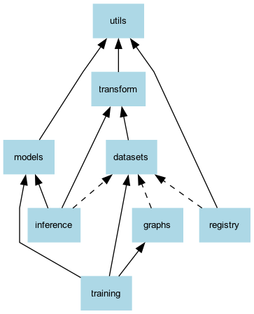
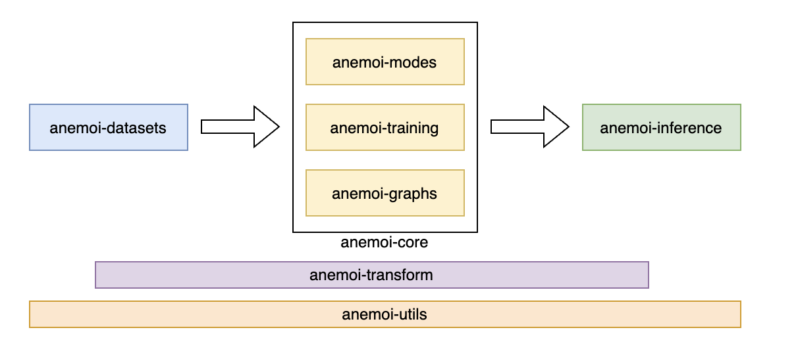

Anemoi Framework
================

[**Overview**](#overview) | [**Features**](#features) | [**Installation**](#installation) | [**Contributing**](#contributing) | [**Roadmap**](#roadmap) | [**Community**](#community) | [**License**](#license) |  [**Other resources & References**](#other-resources--references)

Anemoi is an open-source, Python-based framework developed collaboratively by ECMWF and several European national meteorological services.  It is designed to facilitate the development, training, and deployment of machine learning (ML) models for weather forecasting. As an 'end to end' framework, it provides a comprehensive toolkit that spans data preparation, model training, and inference, enabling meteorological organizations to leverage their own data for ML-based weather prediction.

- [Anemoi - A new framework for Weather Forecasting based on Machine Learning](https://www.ecmwf.int/en/about/media-centre/news/2024/anemoi-new-framework-weather-forecasting-based-machine-learning)

Overview
--------
The `anemoi` repository aims, for now, to provide a centralized overview of the entire framework.
Additionally, it contains the [Anemoi Documentation](https://anemoi.readthedocs.io/en/latest/) and system-level tests that assess the interfaces and ensure all components work well with each other.

Anemoi offers a modular architecture composed of several packages, each targeting different components necessary for constructing data-driven weather models:

- **anemoi-datasets**: Tools for handling and preprocessing meteorological datasets.
- **anemoi-graphs**: Utilities for constructing graph representations of meteorological data.
- **anemoi-models**: Core components for defining and training ML models, including graph neural networks (GNNs) and graph transformers.
- **anemoi-training**: Framework for training ML models, including support for distributed training.
- **anemoi-inference**: Tools for deploying trained models and performing inference.
- **anemoi-transform**: Utilities for data transformation and augmentation.
- **anemoi-utils**: Miscellaneous utility functions.
- **anemoi-registry**: Centralized registry for storing and accessing model configurations and metadata.

Each package collects metadata that can be used by subsequent packages, facilitating a seamless workflow from data ingestion to operational model deployment.

The diagram below shows the relationship of these packages in terms of dependencies.\

The diagram below represents the main packages in the Anemoi framework and the general workflow for using them:

Summary of workflow:
- Start by building a dataset with `anemoi-datasets`.
- Train a model using `anemoi-core` (central yellow boxes inside a black rectangle): This repository groups three distinct but related packages to support model development:
    - `anemoi-modes`: Contains definitions for different machine learning models.
    - `anemoi-training`: Provides the training framework and utilities for fitting models on prepared datasets.
    - `anemoi-graphs`: Supports graph-based representations for modeling meteorological data.
  These three packages are separated to make development easier, but they all live under the anemoi-core GitHub repository.
- Perform predictions with `anemoi-inference`.
- Any domain-specific transformations and code that can be shared across datasets, training, and inference is handled by `anemoi-transform`
- Helper functions and domain-agnostic general purpose utilities are included in `anemoi-utils`.

This structure separates concerns clearly, promotes reusability, and makes development modular while keeping core components organized under anemoi-core.

Each package collects metadata that can be used by subsequent packages, facilitating a seamless workflow from data ingestion to operational model deployment.

Features
--------

- **Modular Design**: Easily extendable components for various stages of the ML pipeline.
- **Customizable Configurations**: Flexible configuration system using Hydra for model and training parameters.
- **Distributed Training Support**: Leverage PyTorch Lightning for scalable and efficient training.
- **Interoperability**: Built on top of established Python tools including PyTorch, Lightning, Hydra, Zarr, Xarray, and Earthkit.
- **Open-Source Collaboration**: Developed in collaboration with multiple European meteorological services.

Installation
------------

To install the Anemoi framework, clone the repository and install the required dependencies::

    $ git clone https://github.com/ecmwf/anemoi-transform.git
    $ cd anemoi-trasnform
    $ pip install -e

Or one can also install each of the packages directly from PyPI

    $ pip install anemoi-transform

For detailed installation instructions and environment setup, refer to the [Installation Guide](https://anemoi.readthedocs.io/en/latest/installation/).

Contributing
------------

We welcome contributions to the Anemoi framework. To get started:

1. Fork the anemoi repository on GitHub to your personal/organisation
   account. See the `GitHub tutorial
[GitHub tutorial])https://docs.github.com/en/get-started/quickstart/fork-a-repo).

2. Set up the development environment following the instructions in the
   :ref:`setting-up-the-development-environment` section.

3. Create a new branch for your developments, following the
   :ref:`branching-guidelines`.

4. Make your changes and ensure that your changes adhere to the
   :ref:`development-guidelines`.

5. Commit your changes and push your branch to your fork on GitHub.

6. Open a Pull Request against the `main` branch of the original
   repository, set a PR title according to the
[PR Title Guidelines](https://anemoi.readthedocs.io/en/latest/contributing/guidelines.html#pr-title-guidelines)

7. Sign the Contributor License Agreement (CLA) on GitHub. If you
   haven't yet signed the CLA for the repository, you will be prompted
   to do so in a comment on your pull request.

8. Request a review from maintainers or other contributors, which will
[Code Review Process](https://anemoi.readthedocs.io/en/latest/contributing/contributing.html#code-review-process).

For detailed contributing guidelines, refer to the [Contributing Guide](https://anemoi.readthedocs.io/en/latest/contributing/).

## Roadmap

The development of the Anemoi framework follows a structured roadmap to ensure continuous improvement and feature development.
For a detailed view of planned milestones, priorities, and upcoming features, see the [Development Roadmap](https://anemoi.readthedocs.io/en/latest/contributing/roadmap.html#development-roadmap).

## Community

The Anemoi framework fosters an open and collaborative community. Governance is guided by clear principles to ensure transparency and inclusiveness, described in the [Governance Documentation](https://anemoi.readthedocs.io/en/latest/contributing/governance.html).

Community members are encouraged to participate in regular interactions such as the [Anemoi Community Meetings](https://anemoi.readthedocs.io/en/latest/contributing/roadmap.html#anemoi-community-meeting), where updates, discussions take place.

## License

Anemoi is licensed under the Apache License 2.0.
See the [LICENSE](https://github.com/ecmwf/anemoi-core/blob/main/LICENSE) file for more details.

For more information, visit the [Anemoi Documentation](https://anemoi.readthedocs.io/en/latest/).

## Other resources & References

Additional resources for using and understanding Anemoi:

- Documentation for each package within the framework: [Anemoi Packages Docs](https://anemoi.readthedocs.io/en/latest/)
- Anemoi webinars: [Anemoi Webinars](https://events.ecmwf.int/event/446/)
- `anemoi-configs` package for example configurations: [Anemoi Configs](https://github.com/ecmwf/anemoi-configs)
- Citation information: [How to Cite Anemoi](https://anemoi.readthedocs.io/en/latest/index.html#how-to-cite-anemoi)
