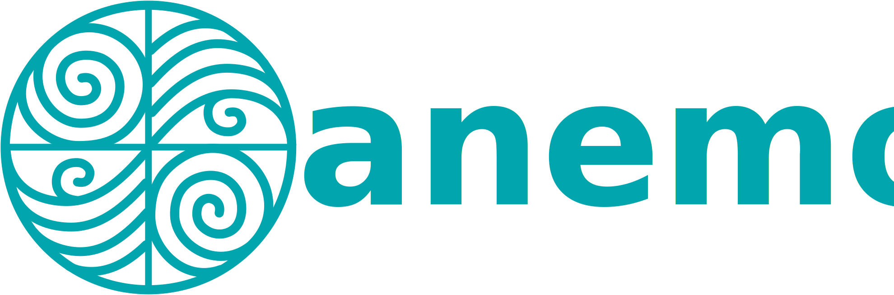

# Anemoi logos

This directory contains the Anemoi logo in three variants:

| File | Description |
| --- | --- |
| [`logo-only.svg`](logo-only.svg) | The logo mark on its own. |
| [`logo-text-below.svg`](logo-text-below.svg) | The logo mark with the "Anemoi" wordmark below it. |
| [`logo-text-right.svg`](logo-text-right.svg) | The logo mark with the "Anemoi" wordmark to its right. |

<p align="center">
  
  &nbsp;&nbsp;&nbsp;
  
  &nbsp;&nbsp;&nbsp;
  
</p>

## Documentation logos (Read the Docs)

To produce a logo with a custom sub-title under the "anemoi" wordmark — for
example one per documentation site on Read the Docs — use `make_logo.py`. It
reads [`docs-logo-template.svg`](docs-logo-template.svg), substitutes your
string, and centres it automatically (glyph widths are embedded in the script,
so it has no dependencies and needs no network or font files).

Create the SVG:

```bash
python3 make_logo.py metadata        # writes metadata.svg
```

Then rasterise it to a 640-pixel-wide PNG (see
[Creating PNGs from the SVGs](#creating-pngs-from-the-svgs) for installing a
converter):

```bash
rsvg-convert -w 640 metadata.svg -o metadata.png
```

Pass `-o` to choose a different SVG filename, e.g.
`python3 make_logo.py "inference" -o logo-inference.svg`.

## About SVG

The logos are provided as **SVG** (Scalable Vector Graphics). SVG is a vector
graphics format: instead of storing a fixed grid of pixels, it describes the
image as shapes (paths, curves, fills). This means it can be **scaled to any
size without losing quality** — there is no blur or pixelation, whether you
display it as a tiny favicon or blow it up to cover a poster.

For most uses (websites, documents, presentations) you can use the SVG files
directly. If you need a raster image — for example a **PNG** for a tool that
does not support SVG — you can generate one at whatever resolution you need
using the instructions below.

## Creating PNGs from the SVGs

Because SVG is scalable, you choose the output resolution when you convert.
The examples below render `logo-only.svg` to a PNG that is 1024 pixels wide;
adjust the filename and size to taste.

### Linux

Most distributions ship with one of these tools (install via your package
manager, e.g. `apt install inkscape librsvg2-bin imagemagick`).

Using **rsvg-convert** (from `librsvg`):

```bash
rsvg-convert -w 1024 logo-only.svg -o logo-only.png
```

Using **Inkscape**:

```bash
inkscape logo-only.svg --export-type=png --export-width=1024 --export-filename=logo-only.png
```

Using **ImageMagick**:

```bash
convert -background none -resize 1024x logo-only.svg logo-only.png
```

### macOS

Install a tool with [Homebrew](https://brew.sh), then convert.

Using **rsvg-convert**:

```bash
brew install librsvg
rsvg-convert -w 1024 logo-only.svg -o logo-only.png
```

Using **Inkscape**:

```bash
brew install --cask inkscape
inkscape logo-only.svg --export-type=png --export-width=1024 --export-filename=logo-only.png
```

The built-in `qlmanage -t` and `sips` tools can also rasterise SVGs, but they
do not let you set an arbitrary resolution as reliably, so the tools above are
recommended.

### Windows

Using **Inkscape** (download from [inkscape.org](https://inkscape.org), then
run in PowerShell or Command Prompt):

```powershell
inkscape logo-only.svg --export-type=png --export-width=1024 --export-filename=logo-only.png
```

Using **ImageMagick** (download from
[imagemagick.org](https://imagemagick.org)):

```powershell
magick -background none -resize 1024x logo-only.svg logo-only.png
```

Alternatively, open the SVG in any modern web browser (Chrome, Edge, Firefox)
and use a browser extension or an online converter to export it as PNG.

### Transparent background

The logos have no background, so the PNGs are transparent by default with
`rsvg-convert` and Inkscape. With ImageMagick, pass `-background none` (shown
above) to preserve transparency instead of getting a white background.
